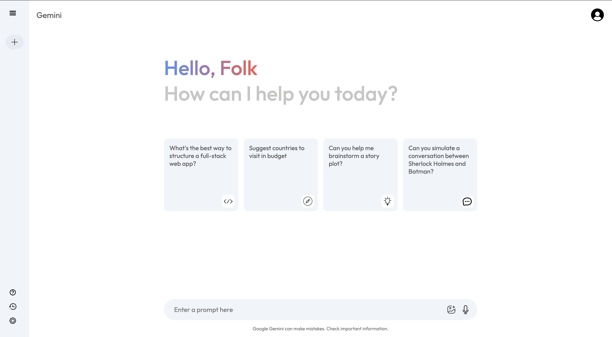
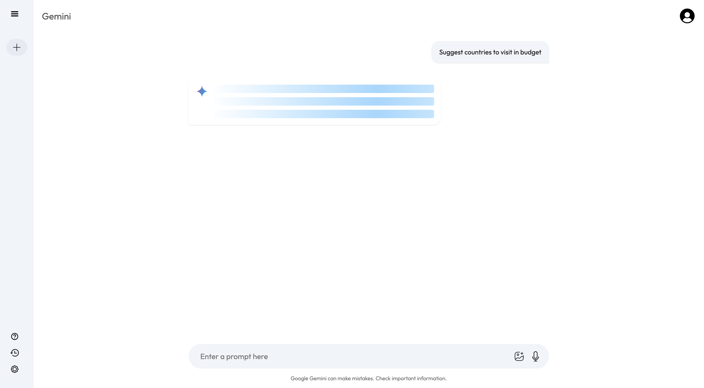

# Gemini Clone ✨

A fully functional and visually polished **Gemini AI clone** — inspired by Google's Gemini UI/UX. This project replicates core Gemini features using **React + Vite**, integrated with **Gemini API**, and styled manually with advanced animations and smooth user interaction.

🔗 [Live Demo](https://gemini-clone-project-theta.vercel.app/)

---

## 📁 Project Structure

```
components/
├── Main/
│   ├── Main.css
│   ├── Main.jsx
│   └── Typerwriter.jsx
├── Sidebar/
│   ├── Sidebar.css
│   └── Sidebar.jsx
├── Context/
│   └── Context.jsx
App.css
App.jsx
index.css
main.jsx
```

---

## 🌟 Features

- 🔁 **New Chat Button** – Instantly resets the session to start a fresh conversation.
- 📄 **Prompt Cards** – Clickable suggestion cards (like “What’s the best way to structure a full-stack web app?”) that instantly load that specific prompt.
- 🧠 **Gemini API Integration** – Connected to the Gemini model for generating intelligent, context-aware responses.
- 🌐 **Context API** – Centralized state management using React’s Context API.
- 🎨 **Manual CSS Styling** – No UI libraries. All design and layout styling is done manually for complete control and accuracy.
- ⌨️ **Typewriter Animation** – Mimics Gemini’s answer typing animation.
- ⚡ **Advanced Loading Animations** – Custom loader animations during API call delays.
- ⚙️ **React + Vite** – Lightning-fast development environment with modern tooling.
- ☁️ **Deployed on Vercel** – Hosted and available live on the internet.

---

## 🚀 Getting Started

### 1. Clone the Repo

```bash
git clone https://github.com/your-username/gemini-clone.git
cd gemini-clone
```

### 2. Install Dependencies

```bash
npm install
```

### 3. Add API Key

Create a `.env` file at the root:

```
VITE_GEMINI_API_KEY=your_api_key_here
```

### 4. Run the App

```bash
npm run dev
```

---

## 📸 Preview




---

## 📦 Deployment

This project is deployed on **Vercel**  
🔗 [gemini-clone-project-theta.vercel.app](https://gemini-clone-project-theta.vercel.app/)

---

## 🛠 Tech Stack

- **Frontend:** React, Vite
- **Styling:** Manual CSS
- **State Management:** Context API
- **Animation:** Custom CSS, Typewriter logic
- **API:** Gemini API (via Google)
- **Hosting:** Vercel

---

## 📌 Credits

Made with ❤️ by Vibhuti – Engineering Student @ Scaler School Of Technology  
This project is built for learning and portfolio purposes and is not affiliated with Google or Gemini.

---

## 📄 License

This project is open-source and free to use.